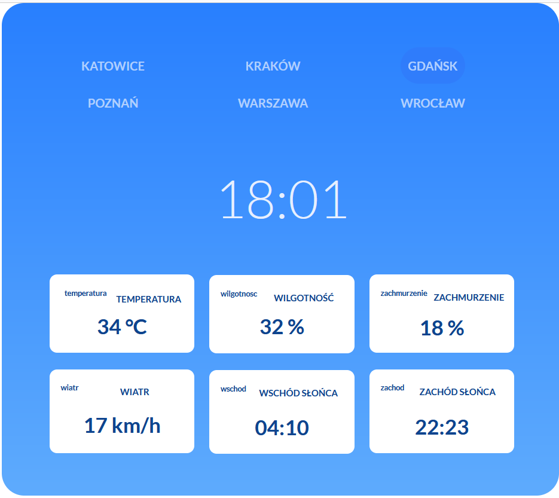

# Weather App

## Description

Weather App is a useful application that allows you to check the weather information for six cities. Users can easily access details such as cloudiness, humidity, temperature, wind speed, sunrise, and sunset times. The app utilizes reliable sources to provide accurate and up-to-date weather data. 

## Technologies Used

-html, css, js (no libraries)

## Author

The Weather App was developed by: Piotrek538
